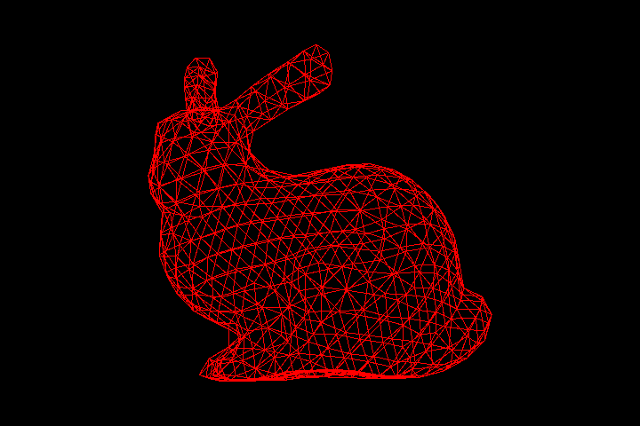
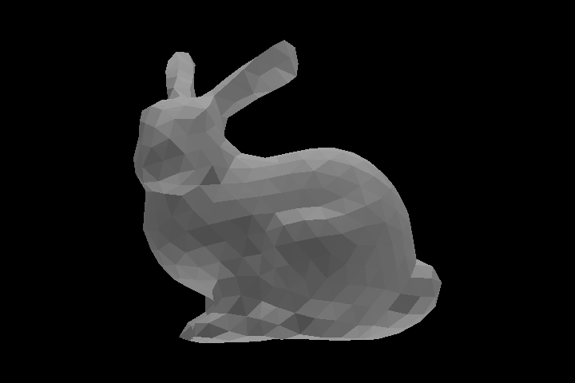

# Rasterization
rendering system for triangulated 3D models based on rasterization

Load and Render a 3D model 
------------------

----------------

Render the bunny using a wireframe; only the edges of the triangles are drawn.

Shading
-------------

In **Flat Shading** each triangle is rendered using a unique normal (i.e. the normal of all the fragments that compose a triangle is simply the normal of the plane that contains it).

In **Per-Vertex Shading** the normals are specified on the vertices of the mesh, the color is computed for each vertex, and then interpolated in the interior of the triangle.

flat shading

vertex shading

Object Transformation 
----------------------------------

animation for flat shading

Camera 
-------------------------------

flat shading and perspective camera

vertex shading and perspective camera

